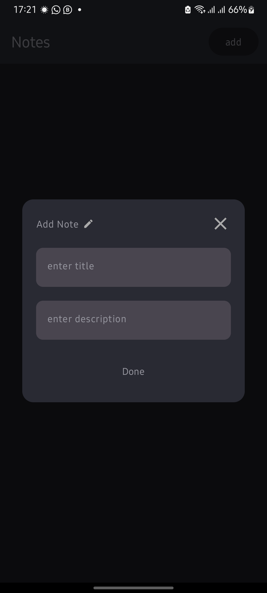
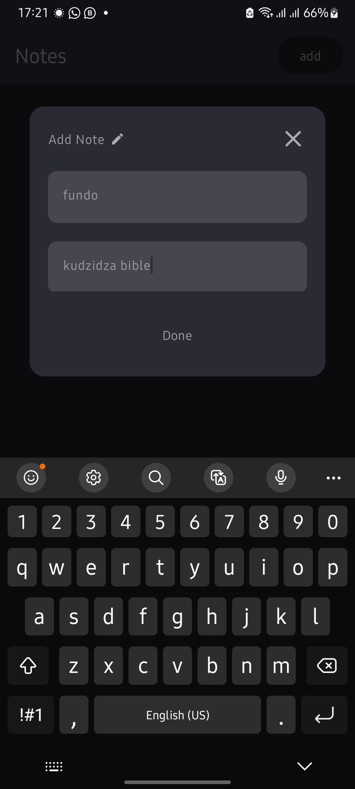

# Notes App Documentation

## Introduction

This documentation provides detailed information about the Notes App, a simple note-taking application developed using Jetpack Compose, Material 3, and Room in Kotlin. The Notes App allows users to create, view, edit, and delete notes, offering a seamless and modern user interface.

## Features

- Create and save notes.
- View a list of all saved notes.
- Edit existing notes.
- Delete notes.


## Technologies Used

- [Jetpack Compose](https://developer.android.com/jetpack/compose) - Modern Android UI toolkit.
- [Material 3](https://material.io/design) - Material Design components for a consistent and beautiful UI.
- [Room](https://developer.android.com/training/data-storage/room) - SQLite object mapping library.
- [Kotlin](https://kotlinlang.org/) - The primary programming language used.

## Installation

1. Clone the repository:

   ```shell
   git clone https://github.com/fraud47/notes_app.git

## Screenshots

 

---
   


---
> PRs are welcome :)


